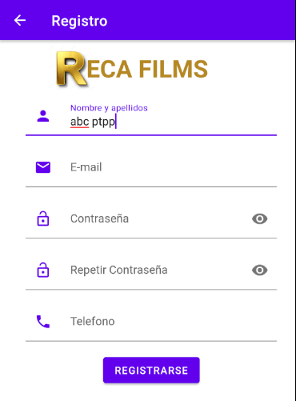
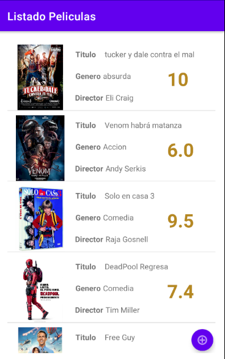

# ProyectoPMDM Antonio Viña Lopez
## Descripción General
###### Proyecto Realizado en la asignatura de programacion de dispositivos moviles (2ºDAM).

###### La aplicación gestiona un listado de peliculas, en la cual puedes consultar, añadir o eliminar
peliculas y su información.

## Pantallas
### Pantalla de Login
En la siguiente pantalla principal consta un Login en el cual si estamos registrados podremos acceder
al listado de peliculas, en caso contrario tendriamos que pulsar en el boton "Registrarse" para crear
un nuevo usuario y así poder acceder al listado de peliculas.

### Pantalla de Registro

En la siguiente imagen podemos observar la tipica pantalla de Registro,
la cual realiza las correspondientes validaciones:

  - Comprobar que ambas contraseñas son iguales
  - Comproba que las contraseñas cumplen unos requisitos minimos
  - Comprobar que el e-mail introducido es válido
  - En el apartado "Telefono comprobar" que solo se insertan números.

### Pantalla de Listado de Peliculas

Una vez conseguimos Logearnos en nuestra app, podemos observar un listado de peliculas.
En esta pantalla tendremos las siguientes funcionalidades:
  - Ver los datos principales de cada película.
  - Al pulsar en cada película nos llevara a una pantalla con todos los detalles de dicha película.
  - En la parte inferior tenemos un boton en el cual podremos añadir una nueva película al listado.

### Pantalla Detalle

En la siguiente imagen podemos observar todos los detalles de la película seleccionada, así como
realizar las siguientes acciones:

