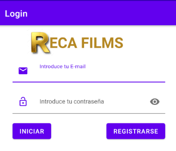

# ProyectoPMDM Antonio Viña Lopez
## Descripción General
###### Proyecto Realizado en la asignatura de programacion de dispositivos moviles (2ºDAM).

La aplicación gestiona un listado de peliculas, en la cual puedes consultar, añadir o eliminar
peliculas y su información.

## Pantallas
### Pantalla de Login
En la siguiente pantalla principal consta un Login en el cual si estamos registrados podremos acceder
al listado de peliculas, en caso contrario tendriamos que pulsar en el boton "Registrarse" para crear
un nuevo usuario y así poder acceder al listado de peliculas.

### Pantalla de Registro